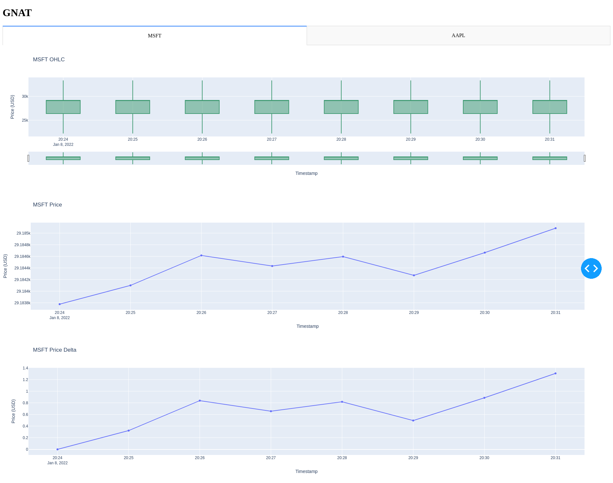
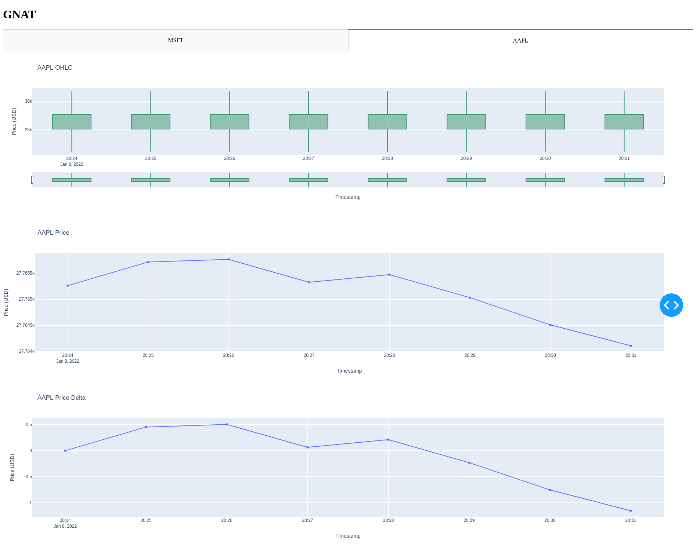

## GNAT

### GNAT is *NOT* Algorithmic Trading!

GNAT is a financial tool with two goals in mind:

1. To provide a dashboard with the detailed stock/crypto information of your choice.
2. To provide confidence in the [Harvest](https://tfukaza.github.io/harvest-website/) framework which GNAT heavily relies on.

### How to use

```bash
pip install -r requirements.txt
python gnat.py
-OR-
python gnat.py my_config.yaml
```

Input the requested information and then go to `localhost:8050` to see the dashboard.

For sending buy, sell requests to GNAT use the following syntax:

```
ACTION TICKER AMOUNT
```

`ACTION` is either `buy` or `sell`

`TICKER` is a valid ticker

`AMOUNT` is a postive integer

Examples:

```
BUY AAPL 5
SELL MSFT 3
BUY @DOGE 10
SELL @BTC 1
```

If you have a configuration that you use often you can create a config file. Here is an example:

```yaml
assets: AAPL # comma seperated values: AAPL, @DOGE, MSFT
streamer: dummy # options are: dummy, yahoo, polygon, alpaca
broker: paper # options are: paper, alpaca
# secret: secret.yaml # path to a file holding polygon or alpaca api tokens if needed
# basic_account: y # For polygon or alpaca, whether the accounts are the basic tier or not; options are: y, n
# alpaca_paper_trader # For alpaca only, whether to use alpaca's paper trader or to trade live, options are y, n
```


### How it works

On start, GNAT asks the user what assets they want to watch for. Then GNAT will ask for some Harvest related configurations. Finally GNAT will start. Both the assets and Harvest configurations can be saved into a yaml file that GNAT can read in.

GNAT runs three threads:

1. One thread runs the Dash server on port 8050. This is where the all the visuals are.
2. Another thread run Harvest which fetches the stock/crypto data.
3. The last thread listens to user input which allows users to buy and sell assets in a limited capacity.

### How its made

GNAT is build off of [Harvest](https://tfukaza.github.io/harvest-website/) and [Dash](https://plotly.com/dash/). [Harvest](https://tfukaza.github.io/harvest-website/) is an algorithmic trading framework that supports multiple brokers and [Dash](https://plotly.com/dash/) is a tool to create awesome plots and data driven web application.


### Example Dashboards



